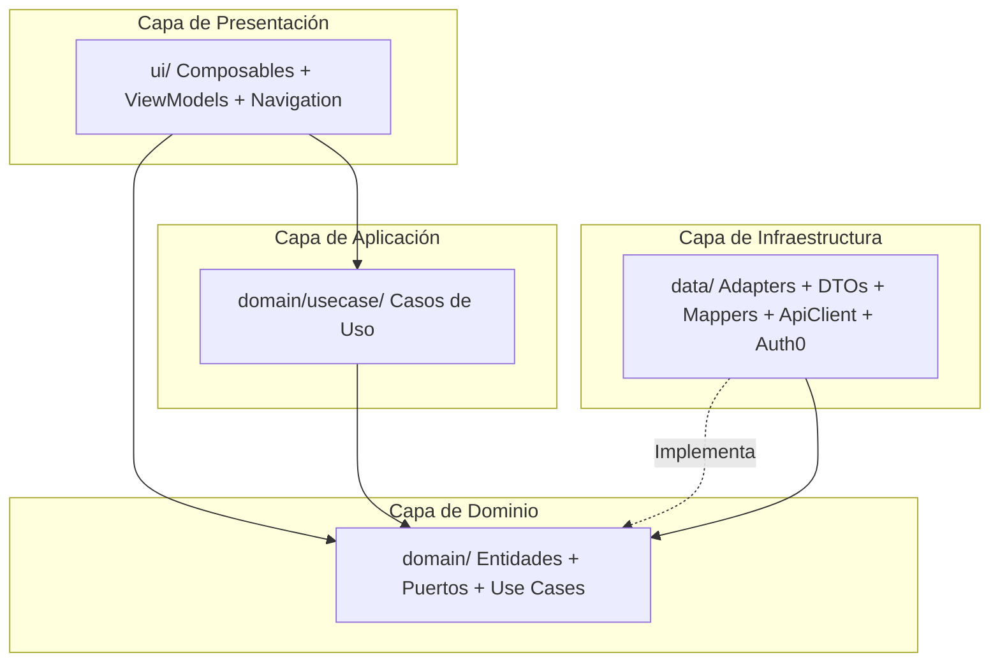

# AGENTS.md — LoResuelvo Android Consumer

Última actualización: 2026-07-12 (Welcome consumer-first + recurso `Categories` desde API)

Fuente canónica para agentes. Leer este archivo primero y cargar skills locales solo cuando apliquen. La documentación para humanos vive en `README.md` (setup y comandos).

## Modo skills-first

1. Leer las reglas globales de este archivo.
2. Elegir la skill adecuada del índice de skills.
3. Cargar solo `skills/<skill>/SKILL.md` y referencias puntuales cuando apliquen.
4. Evitar abrir documentación o código no relacionado con la tarea.

## Stack tecnológico

- **Lenguaje/Build**: Kotlin 2.0.21, AGP 8.13.2, Gradle Wrapper, `libs.versions.toml` como catálogo de versiones.
- **UI**: Jetpack Compose (BOM 2024.09), Material 3, Navigation Compose, `minSdk 24` / `targetSdk 35`.
- **Estado**: StateFlow + UDF. Los `UiState` son `data class` inmutables; los `ViewModel` exponen `StateFlow<UiState>`.
- **DI**: Hilt + `hilt-navigation-compose` para `hiltViewModel()` en composables. `LoresuelvoApp` con `@HiltAndroidApp`. `MainActivity` con `@AndroidEntryPoint`.
- **Auth**: Auth0 SDK 2.11.0.
- **Networking** (en roadmap): Retrofit + OkHttp + `kotlinx-serialization` (a partir de Fase 1).
- **Testing**: JUnit4, MockK, Turbine, `kotlinx-coroutines-test`, Robolectric, `MockWebServer` (OkHttp), Compose-test, Cucumber JVM 7.x para BDD.

## Arquitectura y capas (Clean Architecture liviana + Ports & Adapters)

El proyecto sigue una estructura limpia de capas desacopladas, protegiendo el dominio de la infraestructura y de la UI.



- **Capa de Dominio (`domain/`)**: tipos puros, entidades, value objects, **puertos** (interfaces) y casos de uso. **PURO**: no importa `data/`, `ui/`, `android.*`, ni libs externas (`okhttp3`, `retrofit2`, `kotlinx.serialization`, `dagger`, `hilt`). Validar con grep.
- **Capa de Infraestructura (`data/`)**: adapters que implementan los puertos del dominio. DTOs snake_case del backend con `@SerialName`, mappers DTO↔dominio, `ApiClient`, `Auth0AuthProvider`, `EncryptedAuthSessionStore`, etc. **Único lugar donde pueden vivir DTOs.**
- **Capa de Aplicación (`domain/usecase/` o `application/`)**: casos de uso que orquestan puertos. Sin estado. **No** tragan errores: propagan excepciones o traducen a `sealed interface XxxOutcome` con `Success`/`Failure` tipados.
- **Capa de Presentación (`ui/`)**: composables, `ViewModel`s, navegación, theme, componentes reutilizables. Los `ViewModel` orquestan use cases; los composables solo observan `StateFlow<UiState>` y disparan callbacks.

### Patrones aplicados explícitamente

- **Observer**: `StateFlow` + `collectAsState()` en composables; `viewModelScope.launch` en ViewModels. Ver `ui/session/SessionViewModel.kt:18-23` (collect del `state`) y `MainActivity.kt:50` (`collectAsState`).
- **Adapter**: `ApiUserRepository` adapta el cliente HTTP al puerto `UserRepository`; `ApiCategoryRepository` adapta `GET /categories` al puerto `CategoryRepository`; `Auth0AuthProvider` adapta el SDK de Auth0 al puerto `AuthProvider`. Ver `data/auth/Auth0AuthProvider.kt:16-26` y `data/api/ApiCategoryRepository.kt:16-32`.
- **Factory**: Hilt actúa como factory de dependencias. Complementariamente, los ViewModels se obtienen con `hiltViewModel()` en composables. No usar `viewModelFactory { initializer { ... } }` en producción.
- **Dependency Injection**: Hilt. **Cero** `object` global mutable nuevo. Excepción documentada: `SessionStateHolder` (migración planificada a `@Singleton @Inject`, ver Fase 8).

### Regla de dependencia estricta

**Las capas internas nunca dependen de capas externas.** `domain/` y `domain/usecase/` no deben importar nada de `data/`, `ui/`, `android.*`, ni libs externas. Si un test falla, el build falla.

```bash
# Validación rápida (debe devolver 0 líneas)
grep -RInE "import (com\.loresuelvo\.consumer\.(data|application|ui)|android\.|dagger|hilt|okhttp3|retrofit2|kotlinx\.serialization)" \
  app/src/main/java/com/loresuelvo/consumer/domain/
```

### Regla de pureza del dominio

Los tipos en `domain/` siempre son **camelCase**. Si el backend devuelve `given_name` o `profile_photo_url`, el dominio define `givenName` y `profilePhotoUrl`. La conversión ocurre exclusivamente en mappers dentro de `data/` (ej: `data/api/mapper/UserDtoMapper.kt` cuando exista).

### Regla de DTOs

DTOs del backend (snake_case, anotados con `@SerialName`) **solo** viven en `data/api/dto/`. Nunca se filtran a `domain/` ni a `ui/`. Mapeo en `data/api/mapper/`.

---

## Estructura de carpetas

```txt
app/
  src/
    main/
      java/com/loresuelvo/consumer/
        MainActivity.kt                       # @AndroidEntryPoint, setContent { LoResuelvoNav() }
        LoresuelvoApp.kt                      # @HiltAndroidApp Application class
        data/                                 # Adapters, DTOs, mappers, ApiClient, Auth0
        domain/                               # PURO: entidades, puertos, casos de uso
          auth/                               # User, AuthProvider, AuthSessionStore, etc.
          category/                           # Category, CategoriesOutcome, CategoryRepository
          usecase/auth/                       # RegisterConsumerUseCase, etc.
          usecase/category/                   # GetCategoriesUseCase
          api/                                # ApiError (sealed)
        ui/                                  # Composables, ViewModels, Navigation
          auth/                              # WelcomeVM/State, CompleteProfileVM/State
          components/                        # Botones, inputs, cards, branding
          navigation/                        # LoResuelvoNav, LoResuelvoNavHost, Route
          screens/                           # auth/Welcome, auth/CompleteProfile, home/Home
            auth/components/                 # WelcomeScaffold, TopBar, HeroSection, etc.
          session/                           # SessionViewModel, SessionUiState
          theme/                             # Color.kt, Theme.kt
      res/
        values/strings.xml                    # Strings de UI en español (default)
        values-en/strings.xml                 # Strings en inglés
        xml/                                 # Network security config, etc.
      dev/                                   # Overlays del flavor dev (manifest, res)
    test/                                    # Unit tests JVM (JUnit4 + MockK + Turbine + Cucumber JVM)
      resources/features/                    # .feature BDD de Cucumber (JVM, no androidTest)
      java/.../bdd/                          # Step definitions + CucumberWorld + fakes
    androidTest/
      java/.../acceptance/                   # Acceptance con Compose-test o Espresso
skills/                                      # Skills locales para agentes
AGENTS.md                                    # Este archivo (canónico)
CLAUDE.md                                    # Apunta a AGENTS.md
README.md                                    # Setup + comandos + troubleshooting
```

---

## Índice de skills locales

- `skills/android-clean-architecture` — Aplicar reglas de capas y pureza del dominio.
- `skills/android-bdd-tdd-process` — Ciclo BDD (Gherkin primero) y TDD (RED/GREEN/REFACTOR).
- `skills/android-testing-gates` — Validaciones de cierre: unit, integration, e2e, build.
- `skills/android-api-client-governance` — DTOs, mappers, `ApiClient`, `AuthInterceptor`, `ApiError`.
- `skills/android-hilt-governance` — Módulos, scopes, `@HiltViewModel`, `hiltViewModel()`, tests con Hilt.
- `skills/android-doc-governance` — Mantenimiento de `AGENTS.md`, `CLAUDE.md`, `README.md`, skills.
- `skills/android-commit-governance` — Conventional Commits en inglés, PRs atómicos.

---

## Mapa rápido de decisión

- "Toco una capa o import entre capas": `android-clean-architecture`.
- "Voy a escribir código con tests": `android-bdd-tdd-process`.
- "Estoy por cerrar un PR / quiero validar antes de pushear": `android-testing-gates`.
- "Voy a tocar el cliente HTTP, DTOs, mappers, interceptors": `android-api-client-governance`.
- "Voy a agregar un módulo Hilt, un `@HiltViewModel`, o un test con Hilt": `android-hilt-governance`.
- "Voy a tocar `AGENTS.md`, `CLAUDE.md`, skills o `README.md`": `android-doc-governance`.
- "Voy a hacer commit o PR": `android-commit-governance`.

---

## Reglas críticas

### Calidad

- Alta cohesión, bajo acoplamiento, estricto desacoplamiento de capas (Clean Architecture liviana).
- **Una responsabilidad por archivo**. No agrupar `WelcomeScreen` + `CompleteProfileScreen` en un solo `AuthScreens.kt`.
- Tipos explícitos en fronteras de API, auth y datos compartidos.
- Preferir `sealed interface` para outcomes de use cases y errores de UI.
- **Patrón UDF**: `UiState` inmutable, eventos como `sealed interface XxxEvent` emitidos por `Channel` o `SharedFlow`. **Nunca** meter flags mutables en `UiState`.
- **No** introducir `object` global mutable nuevo. La última (`SessionStateHolder`) se migró a `@Singleton @Inject` en Fase 8 del plan maestro y ya no existe en producción.

### Use cases y errores

- Los use cases **no** tragan errores. Traducen `ApiError` a `XxxOutcome.Failure.*` tipado, o propagan la excepción. **Nunca** `try { ... } catch (e: Exception) { Log.e(...); return Failure("Algo salió mal") }` con string genérico.
- Cada use case es una clase con un solo `operator fun invoke(...)`. Nombre: `VerbSubjectUseCase` (ej: `RegisterConsumerUseCase`).
- Los `Outcome.Failure` deben ser `sealed interface` con subclases tipadas (`Network(cause)`, `Server(code, message)`, `Unauthorized`, etc.), no strings.

### i18n

- **Todo** texto visible al usuario debe estar en `app/src/main/res/values/strings.xml` (es) y `values-en/strings.xml` (en).
- Cero literales en español en `app/src/main/java/.../`. Validar con grep antes de PR:
  ```bash
  grep -RIn '"[A-ZÁÉÍÓÚÑ][a-záéíóúñ ]\+[a-záéíóúúñ]"' app/src/main/java/ | grep -v "Log\\."
  ```
  Solo debería devolver mensajes de error de Auth0 mapeados a `R.string.*`.

### Logging

- **Cero** `Log.d/w/e` directo en `app/src/main/`. Usar `Logger.*` (gated por `BuildConfig.DEBUG`).
- No loguear payloads ni tokens. Ni siquiera en debug.
- Excepción transitoria: durante desarrollo inicial, `Log.d` está permitido **solo** en clases del paquete `data/` y siempre con `BuildConfig.DEBUG` como guard. Migrar a `Logger` antes de PR.

### Seguridad

- Cero secretos en código. La configuración pública de Auth0 (`AUTH0_DOMAIN`, `AUTH0_CLIENT_ID`, `AUTH0_SCHEME`, `AUTH0_AUDIENCE`) y la URL del backend (`API_URL`) se leen de `BuildConfig` con fallbacks; los valores reales vienen de `local.properties` o del pipeline. `AUTH0_AUDIENCE` debe coincidir exactamente con el Identifier lógico de la API que valida Go, mientras `API_URL` es el endpoint de red alcanzable desde el dispositivo. Ver `app/build.gradle.kts` (`envVar(...)` con prioridad `local.properties` > gradle property > env > default).
- No commitear `local.properties`. Está en `.gitignore`.
- Tokens: nunca se loguean, nunca se persisten en `SharedPreferences` plano. `EncryptedAuthSessionStore` usa `EncryptedSharedPreferences` (AES256_GCM/SIV). Ver `data/auth/EncryptedSessionPrefs.kt:8-20`.
- **Fuente de verdad del perfil**: después de cada autenticación exitosa con Auth0, sincronizar contra `GET /me`. Un `200` reemplaza los claims provisionales por el perfil persistido de la API; un `404` identifica una cuenta nueva que debe completar onboarding. No inferir que falta el perfil solo porque el ID token no incluya nombre/apellido.
- **Logout completo**: cerrar primero la sesión SSO de Auth0 mediante Universal Login y limpiar la sesión local solo si ese cierre finaliza correctamente. Si se cancela o falla, conservar la sesión local y mostrar un error reintentable.
- **Cleartext HTTP**: bloqueado por defecto (`targetSdk 35`). Solo el flavor `dev` permite texto plano mediante `app/src/dev/res/xml/network_security_config.xml` (overlay via `app/src/dev/AndroidManifest.xml`). Para un teléfono físico conectado por ADB, preferir `adb reverse tcp:8080 tcp:8080` + `API_URL=http://127.0.0.1:8080`; la regla debe recrearse después de reconectar. Para una API local de LAN, usar `API_URL=http://<ip-de-tu-host>:8080`. Reconstruir siempre `devDebug` después de cambiar la URL. **Staging/prod quedan HTTPS-only** (no heredan ese config).

### Topología (regla de `MainActivity`)

- `MainActivity.onCreate` debe ser **≤ 15 líneas** y limitarse a:
  ```kotlin
  @AndroidEntryPoint
  class MainActivity : ComponentActivity() {
      override fun onCreate(savedInstanceState: Bundle?) {
          super.onCreate(savedInstanceState)
          setContent { LoResuelvoNav() }
      }
  }
  ```
- **`@AndroidEntryPoint` es OBLIGATORIO.** Sin él, el primer `hiltViewModel()` que se invoque desde el composable (es decir, en producción: la smart-router; en instrumentación: la primera línea de `LoResuelvoNav`) crashea el proceso con `IllegalStateException: Given component holder class MainActivity does not implement interface dagger.hilt.internal.GeneratedComponent`. No tiene derivación a runtime tolerable: o está la anotación o la app no arranca.
- Toda la lógica de composición (NavHost, decisión de `startDestination`, `composable` con `hiltViewModel()`) vive en `LoResuelvoNav` (en `ui/navigation/`).
- Si `MainActivity` crece más de 15 líneas, falla el code review.

### Tests instrumentados (`androidTest/`)

- `HiltTestRunner` (configurado en `build.gradle.kts` como `testInstrumentationRunner`) hace `AndroidJUnitRunner.newApplication()` retorne `HiltTestApplication` en lugar de `LoresuelvoApp`. `HiltTestApplication.generatedComponent()` **no inicializa el component graph** — eso solo ocurre cuando un test class declara `@HiltAndroidTest` + `@get:Rule(order = 0) val hiltRule = HiltAndroidRule(this)` (y la regla está pensada para correr antes que la regla de Compose).
- Toda acceptance test que levante `MainActivity` (vía `createAndroidComposeRule<MainActivity>()`) **debe** declarar ambas cosas, o el proceso crashea con `IllegalStateException: The component was not created. Check that you have added the HiltAndroidRule.` apenas se carga la Activity.
- Si el test necesita overrides de Hilt modules, usar `@UninstallModules(...)` con un módulo `@InstallIn` anidado cuando el fake deba afectar una sola clase, o `@TestInstallIn(...) replaces = [...]` cuando deba aplicar a toda la suite. `CompleteProfileScreenAcceptanceTest` reemplaza `RepositoryModule` sólo en esa clase: conserva el `EncryptedAuthSessionStore` real y sustituye `UserRepository` para que el flujo feliz no dependa del backend ni de un token real.

### Aceptación: mutar el session store desde tests

- Pre-Fase 8 el contrato era "construir un `EncryptedAuthSessionStore` local y `clearSession()` / `saveSession(...)` con él": el `object SessionStateHolder` propagaba el cambio al `MainActivity` que también leía del mismo StateFlow global.
- Post-Fase 8 ese `object` ya no existe. Las acceptance tests deben pedirle al MISMO `SingletonComponent` que la `SessionViewModel` del activity observa el `AuthSessionStore` real, y mutarlo. **NO** `@Inject lateinit var sessionStore: AuthSessionStore` — el `MembersInjector` puede entregar una instancia distinta a la que la activity ve a través de `createAndroidComposeRule<MainActivity>()` cuando el binding es a una **interfaz**. En su lugar, usá `@EntryPoint`-basado:
  ```kotlin
  private val sessionStore: AuthSessionStore by lazy {
      EntryPointAccessors.fromApplication(
          ApplicationProvider.getApplicationContext<Application>(),
          AuthSessionStoreEntryPoint::class.java,
      ).authSessionStore()
  }

  @EntryPoint
  @InstallIn(SingletonComponent::class)
  interface AuthSessionStoreEntryPoint {
      fun authSessionStore(): AuthSessionStore
  }
  ```
  Construir `EncryptedAuthSessionStore(createEncryptedSessionPrefs(activity))` local escribe a `SharedPreferences` correctamente pero el `StateFlow` del singleton Hilt no se entera → `LoResuelvoNav` enruta con el valor viejo después de `scenario.recreate()`.

### Aceptación: Locale del CI

- El emulator del CI bootea con `en-US` por default. `CompleteProfileScreen` (y todos los Composables que usen `stringResource(R.string.*)`) renderizan la versión `values-en/strings.xml` → "Continue", "First name", etc.
- Los acceptance tests no deben asumir el locale del dispositivo ni forzarlo con `Resources.updateConfiguration(...)`: Android 14 puede ignorar ese override durante la creación de la Activity.
- Para encontrar texto producido por `stringResource`, resolver el mismo recurso desde la Activity de la regla Compose. Así la prueba valida el contrato UI tanto en `en-US` como en `es-AR`:
  ```kotlin
  private fun localizedString(resourceId: Int): String =
      composeTestRule.activity.getString(resourceId)

  composeTestRule.onNodeWithText(
      localizedString(R.string.complete_profile_button_continue),
  )
  ```
- Ver `app/src/androidTest/java/com/loresuelvo/consumer/acceptance/auth/CompleteProfileScreenAcceptanceTest.kt`. Los strings visibles siguen definidos en `values/strings.xml` y `values-en/strings.xml`.

### DI (Hilt)

- `@HiltAndroidApp` en `LoresuelvoApp`. `@AndroidEntryPoint` en `MainActivity`. `@HiltViewModel` en todos los ViewModels.
- Módulos: `di/NetworkModule`, `di/RepositoryModule`, `di/UseCaseModule`. Cada uno con `@InstallIn(SingletonComponent::class)` o `@InstallIn(ViewModelComponent::class)` según el scope.
- Repositorios: `@Binds @Singleton` en `RepositoryModule`. No instanciar repos a mano.
- ViewModels: `hiltViewModel<T>()` en composables. **No** usar `viewModelFactory { initializer { ... } }` en producción.
- Tests con Hilt: `@HiltAndroidTest` + `@UninstallModules(...)` + `@TestInstallIn(..., replaces = [...])` que provee fakes. Ver `skills/android-hilt-governance`.

### Idioma y estilo

- Texto visible para usuarios: español, centralizado en `strings.xml`.
- Código, tests, nombres de variables, comentarios técnicos: inglés.
- Steps de BDD: español (alineado con el webapp).
- Commits y mensajes de PR: inglés, Conventional Commits.
- Comentarios explicativos (que agreguen info, no describan lo obvio) en español.

---

## BDD con Cucumber JVM

La capa BDD vive **en el source set de JVM** (`src/test/`), no en `androidTest/`:

- `.feature` files: `app/src/test/resources/features/<area>/<user-journey>.feature`
- Step definitions + CucumberWorld + fakes: `app/src/test/java/com/loresuelvo/consumer/bdd/<area>/<journey>/...`
- Glue runner: una clase con `@RunWith(io.cucumber.junit.Cucumber.class)` + `@CucumberOptions(features = ["classpath:features/..."], glue = ["..."], plugin = ["pretty", "summary"])`.

**Por qué JVM, no instrumented**:

- Corre en el classpath normal de Gradle sin emulador; el ciclo `test` lo ejecuta sin cost extra.
- No requiere Robolectric, Hilt ni Auth0 — ejercitamos el `ViewModel` directo contra fakes (`FakeAuthSessionStore`, `FakeUserRepository`) y un `StandardTestDispatcher` que controla `viewModelScope`.
- Sin Robolectric no hay flakiness de pixel rendering ni lock al `targetSdk` actual.

**Cómo agregar un nuevo escenario**:

1. Editar o crear el `.feature` con Gherkin (español o inglés según público).
2. Escribir el step exacto (con su `Given/When/Then` + tipos de parámetros `{string}`, `{int}`).
3. Declarar el step def en `RegisterConsumerSteps.kt` (o el que corresponda). Si la acción dispara coroutines, usar `world.tapContinue()`, `world.setFirstName(...)`, etc. — todos avanzan el `TestCoroutineScheduler` por vos.
4. Si necesitás un nuevo tipo de outcome (hoy `Success`/`Network`/`Server`/`Unauthorized`), agregalo al `FakeUserRepository` y a `ErrorCategoryMatcher`.
5. Validar con `./gradlew :app:testDevDebugUnitTest --tests "*<Runner>Test*"`.

**Las palabras del usuario en español** se asertan en el layer de UI (Compose UI tests), no aquí. El BDD asserta el **tipo de error** (`first name required`, `network`, `server`, `session expired`) y los **efectos observables** (session cleared, POST enviado, evento `NavigateToHome`).

---

## Comandos de validación

Comandos actuales del repo:

```bash
make help
make build         # assembleDevDebug
make lint          # lintDevDebug
make test          # testDevDebugUnitTest
make e2e           # connectedDevDebugAndroidTest con package=...acceptance
make test-all-once # test + e2e
make ci            # build + lint + test-all-once
make clean
make devices
```

Variables: `FLAVOR=Dev|Staging|Prod` (default: `Dev`).

### Política

1. **TDD/BDD primero**: el test se escribe antes del impl. RED local, GREEN local, REFACTOR. Sin acoplar a red real en tests unitarios.
2. **Durante iteración**: ejecutar pruebas focalizadas (`./gradlew :app:testDevDebugUnitTest --tests *CompleteProfileViewModelTest*`).
3. **Antes de PR**: `make lint && make test && make build` verde. Si cambió un flujo BDD, también `make e2e`.
4. **Antes de merge a `main`**: `make ci` verde completo.
5. **Fail-fast**: detenerse en la primera falla, corregir y re-ejecutar.

---

## Checklist final para agentes

1. Skill correcta cargada y aplicada.
2. Tests escritos **antes** del impl (TDD). BDD `.feature` escrito antes de los steps.
3. Diff revisado: sin archivos generados accidentales, sin archivos debug.
4. Sin secretos, sin logs sensibles, sin literales en español en código.
5. Cero `Log.d/e/w` directo en código de producción.
6. Strings de UI en `strings.xml` (es + en).
7. `make lint && make test && make build` verde.
8. Si cambió un flujo con `.feature`, `make e2e` verde.
9. `AGENTS.md` actualizado si cambió arquitectura, convención, o comandos.
10. Resumen final conciso con archivos tocados, validación y riesgos residuales.
