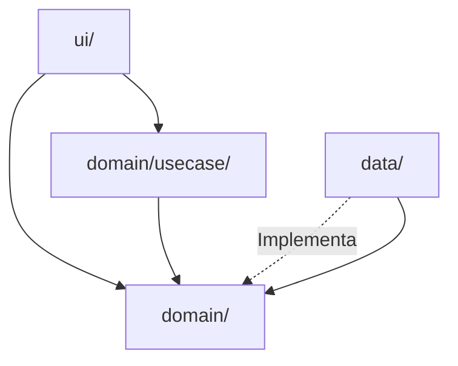

# android-clean-architecture

Aplicar y validar las reglas de capas y pureza del dominio en el proyecto Android. Cargar cuando se vaya a crear, mover o modificar código en `domain/`, `data/`, `ui/` o `domain/usecase/`, o cuando se dude de si un import viola la arquitectura.

## Cuándo NO cargar

- Cambios puramente de UI (colores, textos, layouts) que no toquen capas.
- Cambios en scripts de build, Gradle, CI.
- Cambios en `AGENTS.md` o skills (usar `android-doc-governance`).

## Capas (resumen)



- **`domain/`**: PURO. Entidades, value objects, **puertos** (interfaces), `ApiError` (sealed).
- **`domain/usecase/`**: casos de uso. Un `operator fun invoke` por clase. Nombre: `VerbSubjectUseCase`.
- **`data/`**: adapters (Auth0, ApiUserRepository, etc.), DTOs snake_case, mappers, `ApiClient`, `EncryptedAuthSessionStore`.
- **`ui/`**: composables, ViewModels, navegación, theme, componentes.

## Reglas de dependencia

- `domain/` NO importa: `data/`, `ui/`, `android.*`, `dagger`, `hilt`, `okhttp3`, `retrofit2`, `kotlinx.serialization`.
- `domain/usecase/` NO importa: `data/`, `ui/`. Sí puede importar `domain/`.
- `data/` puede importar `domain/` (para implementar puertos).
- `ui/` puede importar `domain/usecase/` y `domain/`. NO importa `data/` directamente (las dependencias se inyectan vía Hilt).

## Validación con grep

Antes de PR, correr:

```bash
# 1. ¿domain importa data/ui/android/libs externas?
grep -RInE "import (com\.loresuelvo\.consumer\.(data|application|ui)|android\.|dagger|hilt|okhttp3|retrofit2|kotlinx\.serialization)" \
  app/src/main/java/com/loresuelvo/consumer/domain/
# Debe devolver 0 líneas.

# 2. ¿ui importa data directamente? (debería pasar solo por Hilt)
grep -RInE "import com\.loresuelvo\.consumer\.data\." app/src/main/java/com/loresuelvo/consumer/ui/
# Permitido solo en data classes o wrappers de UI que son DTOs por accidente. Mejor: 0.
```

Si cualquier grep devuelve hits, el code review falla.

## Reglas de naming

- **Puertos** (interfaces en `domain/`): nombre del concepto en singular, sin sufijo `I`. Ej: `UserRepository`, `AuthProvider`, `AuthSessionStore`.
- **Adapters** (en `data/`): prefijo del backend o tecnología + `Repository`/`Provider`/`Client`. Ej: `ApiUserRepository`, `Auth0AuthProvider`, `Auth0CredentialsMapper`.
- **Mappers**: `<Entity>Mapper.kt` con `toDomain()` y `toDto()`.
- **Use cases**: `VerbSubjectUseCase`. Ej: `RegisterConsumerUseCase`, `CompleteOnboardingUseCase`. **No** `UserRegistration` (eso es un outcome, no un use case).
- **Outcomes**: `sealed interface <Verb>Outcome` con `Success(...)` y subclases de `Failure` tipadas. Ej: `UserRegistrationOutcome.Failure.Server(code, message)`.

## Reglas de outcomes y errores

- Outcomes siempre `sealed interface`. Nunca `String` para errores.
- Subclases de `Failure`:
  - `Network(cause: Throwable)` para fallos de transporte.
  - `Server(code: Int, message: String)` para 4xx/5xx con body.
  - `Unauthorized(message: String)` para 401 (código separado para forzar `clearSession`).
  - `Unknown(cause: Throwable?)` para fallback.
- **NO** `Failure.Generic(val message: String)`. Si no encaja en las anteriores, agregá una subclase nueva, no uses string genérico.

## DTOs y mappers

- DTOs solo en `data/api/dto/`. Anotados con `@Serializable` y `@SerialName("snake_case_field")` cuando difiere del nombre Kotlin.
- El dominio nunca ve DTOs. Mappers en `data/api/mapper/`.
- Si la API devuelve 10 campos y el dominio solo usa 4, el DTO tiene los 10 y el mapper descarta los 6. No filtrar campos no usados al dominio.

## Anti-patrones explícitos

- ❌ `object` global mutable nuevo. El `SessionStateHolder` actual es una **excepción documentada** que se migra a `@Singleton @Inject` (Fase 8 del plan maestro).
- ❌ Repositorios instanciados con `new` o `=`. Siempre `@Inject` o `@Provides`.
- ❌ `viewModelFactory { initializer { ... } }` en producción. Usar `hiltViewModel<T>()`.
- ❌ `Log.d`/`Log.e` directo. Usar `Logger`.
- ❌ Strings en español hardcoded en código. Usar `strings.xml`.
- ❌ `try { } catch (e: Exception) { Log.e(...); "Algo salió mal" }` en use cases. Tipar la failure.
- ❌ Pasar `Context` a ViewModels o use cases. Si hace falta, usar `ApplicationContext` y mantenerlo como dependencia explícita.

## Ejemplo concreto del proyecto

- **Puerto bien hecho**: `domain/auth/AuthProvider.kt:3-6`:
  ```kotlin
  interface AuthProvider {
      suspend fun signup(): SignupOutcome
  }
  ```
  Puro, sin imports externos. Implementado por `data/auth/Auth0AuthProvider.kt:16-37`.

- **Use case que orquesta un puerto** (estructura esperada, no existe aún):
  ```kotlin
  class RegisterConsumerUseCase @Inject constructor(
      private val userRepository: UserRepository,
      private val authSessionStore: AuthSessionStore,
  ) {
      suspend operator fun invoke(command: RegisterConsumerCommand): UserRegistrationOutcome {
          val session = authSessionStore.getSession()
              ?: return UserRegistrationOutcome.Failure.Unauthorized("Sin sesión activa")
          return userRepository.registerConsumer(/* ... */)
      }
  }
  ```

## Referencia rápida

- `AGENTS.md` → secciones "Arquitectura y capas", "Regla de dependencia estricta", "Regla de pureza del dominio".
- `AGENTS.md` → "Regla de DTOs" para el binding snake_case ↔ camelCase.
- `domain/auth/AuthProvider.kt:3` ejemplo de puerto.
- `data/auth/Auth0AuthProvider.kt:16` ejemplo de adapter.
- `domain/auth/SignupOutcome.kt:3-7` ejemplo de sealed interface.
